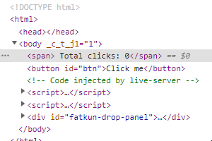
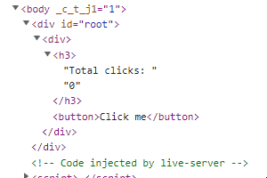

# :white_check_mark: THE BASICS OF REACT

## :large_orange_diamond: vanillaJS
```javascript
<!DOCTYPE html> 
<html>
<body>
    <span> Total clicks: 0</span>
    <button id="btn">Click me</button>
</body>
<script>
    let counter = 0;
    const button = document.getElementById("btn");
    const span = document.querySelector("span");
    function handleClick(){
        counter = counter + 1;
        span.innerHTML = ` Total clicks: ` + counter;
    }
    button.addEventListener("click", handleClick)
</script>
</html>
```

<br><br>

## :large_orange_diamond: Old ReactJS
```javascript
<!DOCTYPE html> 
<html>
    <body>
        <div id="root"></div>
    </body>
    <script src="https://unpkg.com/react@17.0.2/umd/react.production.min.js"></script>
    <script src="https://unpkg.com/react-dom@17.0.2/umd/react-dom.production.min.js"></script>
    <script>
        let counter = 0;
        const root = document.getElementById("root")
        const span = React.createElement(
            "span", 
            {onMouseEnter:() => console.log("hi")}, 
            "hover"
        );
        const button = React.createElement(
            "button",
            {onClick:() => console.log(++counter)},
            "clickMe"
        );
        const container = React.createElement("div", null, [span, button])
        ReactDOM.render(container, root);
    </script>
</html>
```

<br><br>

## :large_orange_diamond: ReactJS + JSX + babel
```javascript
<!DOCTYPE html> 
<html>
    <body>
        <div id="root"></div>
    </body>
    <script src="https://unpkg.com/react@17.0.2/umd/react.production.min.js"></script>
    <script src="https://unpkg.com/react-dom@17.0.2/umd/react-dom.production.min.js"></script>
    <script src="https://unpkg.com/@babel/standalone/babel.min.js"></script>
    <script type="text/babel">
        const root = document.getElementById("root");
        const Title = () => (
            <h3 id="title" onMouseEnter={() => console.log("mouse Enter")}>
                Hello I'm a title
            </h3> 
        );
        const Button = () => (
            <button style={{ backgroundColor: 'tomato' }} onClick={() => console.log("im clicked")}>
                Click me
            </button>
        );

        const Container = () => (
            <div>
                <Title /> 
                <Button />
            </div>
        );
        ReactDOM.render(<Container/>, root);
    </script>
</html>
```
JSX 에서 가장 기억해야하는것은 대소문자를 구분해야한다.  
소문자는 일반태그로 인식하고, 대문자는 변수로 만든 태그로 인식한다.  
컨테이너에 넣을때는 변수타입이 함수타입이어야 인식한다.

<br><br>

# :white_check_mark: Difference between VanillaJS and ReactJS

| VanillaJS | ReactJS |
|:-------:|:----------:|
|||

바닐라JS는 이벤트가 처리될때 처리되는 모든 부분이 업데이트되는 반면, 리액트는 다른부분만 업데이트가 된다.


# :white_check_mark: Understanding State
## :large_orange_diamond: Not a good way
```javascript
<!DOCTYPE html> 
<html>
    <body>
        <div id="root"></div>
    </body>
    <script src="https://unpkg.com/react@17.0.2/umd/react.production.min.js"></script>
    <script src="https://unpkg.com/react-dom@17.0.2/umd/react-dom.production.min.js"></script>
    <script src="https://unpkg.com/@babel/standalone/babel.min.js"></script>
    <script type="text/babel">
        const root = document.getElementById("root");
        let counter = 0;
        function countUp() {
            counter = counter + 1;
            ReactDOM.render(<Container/>, root);  // {1}
        }
        const Container = () => (
            <div>
                <h3>Total clicks: {counter}</h3> // 중괄호를 넣으면 변수나 함수를 넣을수있다.
                <button onClick={countUp}>Click me</button>
            </div>
        );
        ReactDOM.render(<Container/>, root);
    </script>
</html>
```
{1} 이 없을경우 렌더링이 1번만 돼서 counter가 1추가되더라도 렌더링이 되지않아 업데이트가 안된다.
그 문제를 해결하기 위해 countup 이라는 함수에서 렌더링을 한 번 더 시켜줬다.
하지만 이러한 방법은 좋지 않은 방법이다.

<br><br>

## :large_orange_diamond: Best way